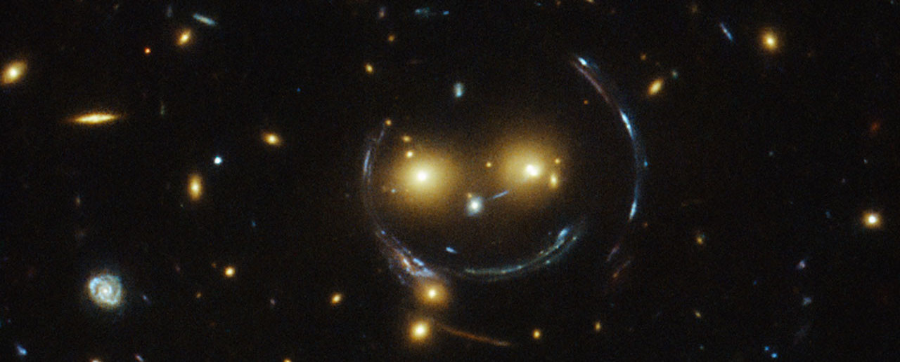

 Image Credit: NASA/ESA

I am first year postdoctoral researcher at the Brandeis University working with Professor Marcelle Soares-Santos. My main field is Observational Cosmology, where I am interested in understanding the formation and evolution of the Universe through the analysis of astronomical data from wide field surveys.

I am member of the Dark Energy Survey (DES) and the Large Synoptic Survey Telescope Dark Energy Science Collaboration (LSST-DESC). Currently, DES is the project with the most precise measurements of the large-scale structure of the universe using multiple observational probes. In 2020's, LSST will surpass DES with much more statistics and depth. Besides this big collaborations, I was also involved with smaller but still very interesting projects such as SOGRAS, CS82, VICS82 and Blink.     

DES
======
DES is an optical imaging survey that will observe, in 5 years, 5000 square degrees of the celestial southern hemisphere with a 570 megapixels camera with red-sensitive CCDs (DECam) installed on the 4m Blanco Telescope, located at the Cerro Tololo Inter-American Observatory (CTIO) in Chile. DES uses the $grizY$ bands to obtain photometric redshifts and will reach limiting magnitudes of $i \sim 24$ when finalized.

The observations are carried out during roughly one semester per year, and the first season took place in 2012-2013, a period called Science Verification (SV). The SV data covered 250 square degrees reaching almost the depth of the complete survey. For this dataset, a thorough search for strong gravitational lensing systems was carried out, involving several selection criteria and including the visual inspection of the images. I had an active participation in this search, which identified 53 candidate systems, 6 of which were later confirmed by spectroscopic observations.

Recently, the first results using data from a full operating season of DES, the so-called year 1 (Y1) data set, were made [public](https://www.darkenergysurvey.org/news-and-results/publications/). The Y1 data covers 1500 sq.-deg at 40% of the final depth of the survey. The data from the third season, Y3 (covering 5000 sq.-deg at 50% of the depth), has already been processed, but the catalogs are still being vetted. The data taking for Y5 has already been completed. Currently, I am working in the weak mass calibration of the Y1 redmaPPer clusters using a new mass proxy named $\mu_{\star}$. I am involved in the generation of the Y3 measurements for the main cosmology analysis of the survey that combine different probes.     

LSST
======

The Large Synoptic Survey Telescope (LSST) project will conduct a 10-year survey of the sky that will deliver a 200 petabyte set of images and data products that will address some of the most pressing questions about the structure and evolution of the universe and the objects in it...

BlinK
======
The Blanco i-band Kilo-degree Survey (BlinK) is a 1000 sq-deg survey in the i-band with DECam down to $mag_{AB}$: 22.5. This data will enable us to study galaxy clusters, discover new strong lensing systems, study Lyman Break Analog Systems, find new star-forming early-type galaxies, study compact and fossil groups, in addition to carry out studies of large-scale structure and correlation with other wavelengths. Our kilo-degree field has not been previously explored in the i-band to the proposed depth nor with the DECam image quality and will benefit from existing spectroscopic data from SDSS and WiggleZ, and multi-wavelength data from other surveys, including existing DECam $grz$ data. This program builds up on the CFHT Stripe 82 (CS82) i-band survey and will be performed in close collaboration with the Blanco Imaging of the Southern Sky (BLISS) project and other DECam surveys. In addition to being a survey on its own, this proposal will have an impact on the current landscape of wide-field surveys, complementing the growing coverage of the extragalactic sky for dec < 30 deg. It can provide support to other surveys in the field, such as J-PLUS, and have a legacy value for targeting spectroscopic surveys or complementing the wavelength coverage of imaging surveys.

CS82
======

CS82 is a collaboration involving researchers from several countries, which used French, Canadian and Brazilian time on
the Canada-France-Hawaii Telescope (CFHT) --- a 3.6 meter aperture (optical and infrared) telescope located on Mount Mauna Kea, Hawaii --- to image $\approx 170$ square degrees ($-42.5<RA <45$ and $-1<DEC<+1$) in the Stripe 82.

Motivated by the high availability of data at different wavelengths in that region, a group of collaborators designed CS82 to be the weak lensing survey on Stripe 82, profiting from the excellent image quality provided by the CFHT telescope. The region was imaged in the $i$ band, providing data with a depth up to $i=23.5$ with excellent seeing conditions (average value of $ 0.6^{\prime\prime}$). The CS82 survey also motivated a new survey in the infrared, VICS82.

I worked in estimation of the morphological information of the objects by modeling the Point Spread Function (PSF) of the images and fitting brightness profiles to the objects. I carried out several tests to optimize the generation of these morphology catalogs. I have also performed a stack weak lensing analysis for this survey by the combination with the produced shear catalog and the SDDS redMaPPer cluster public catalog. Due to my contributions to the survey I was considered part of the {\it core team} of the project.

SOGRAS
======

The SOAR GRavitational Arc Survey (SOGRAS) project observed 47 massive clusters, most of them in Stripe 82, to search for strong lensing features. The observations were made in the $g^{\prime}r^{\prime}i^{\prime}$ bands of the $4.2m$ SOAR telescope located at Cerro Pachón (Chile). The clusters were observed at two redshift intervals ($z\simeq 0.3$ and $z\simeq 0.5 $) with a required seeing of $\le 0.8^{\prime\prime}$. Four clusters in this sample that have very good arc candidates were followed-up for deeper imaging and multi-object spectroscopy with the Gemini South Telescope, aiming to determine their dynamical masses and to improve the shape measurements for deriving weak lensing masses. I also participated in the selection of these clusters.
